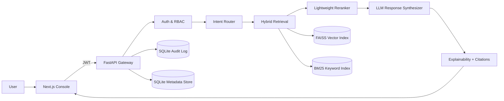
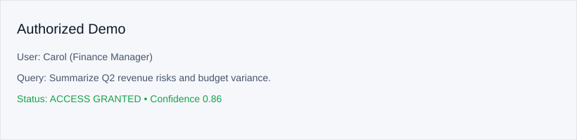
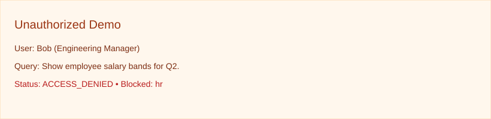
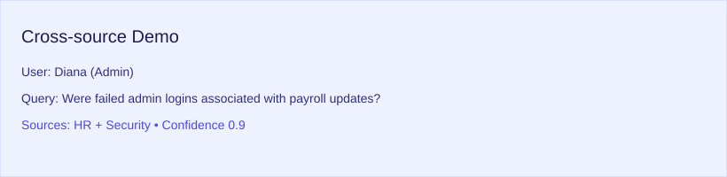

# Ragverse

Production-grade, enterprise-focused Retrieval-Augmented Generation (RAG) system with RBAC-first security, explainable retrieval, and demo-ready UX.

## 1. Problem Statement
Enterprise knowledge is fragmented across HR, Finance, Engineering, Security, and Compliance systems. Ragverse unifies retrieval while enforcing least-privilege access controls, auditability, and explainability for security-conscious AI.

## 2. Architecture Diagram


## 3. Security Model (Most Important)
- **RBAC before retrieval**: deny-by-default with hierarchical roles (admin > manager > analyst).
- **Metadata filtering**: every chunk carries classification + allowed roles.
- **Least privilege**: only routed and authorized sources are queried.
- **Audit logging**: user, query, sources accessed, blocked sources, timestamp, confidence.
- **Prompt-injection defense**: detects and blocks malicious instruction patterns.
- **Explicit access denial**: returns `ACCESS_DENIED` without leaking content.

## 4. Retrieval Pipeline
1. Login → JWT
2. Intent classification → source routing
3. RBAC filtering (deny-by-default)
4. Section-aware chunking (500/100)
5. Hybrid retrieval (FAISS + BM25)
6. Lightweight reranking
7. LLM synthesis with citations
8. Explainability + confidence scoring

Confidence uses semantic similarity and retrieval agreement to produce a 0–1 score.

## 5. Demo Users
| User | Role |
| --- | --- |
| Alice | HR Manager |
| Bob | Engineering Manager |
| Carol | Finance Manager |
| Diana | Admin |

## 6. Example Queries (Demo Ready)
**Authorized**
- “Summarize Q2 revenue risks and budget variance.”

**Unauthorized**
- “Show employee salary bands for Q2.”

**Cross-source**
- “Were failed admin logins associated with payroll updates?”

### Screenshots




## 7. Quick Start
```bash
python backend/scripts/generate_sample_dataset.py

cd backend
pip install -r requirements.txt
uvicorn app.main:app --reload --port 8000

cd ../frontend
npm install
npm run dev
```

## 8. Tests
```bash
cd backend
pytest
```

## 9. Deployment
| Layer | Platform |
| --- | --- |
| Frontend | Vercel |
| Backend | Railway |
| Vector Store | Local FAISS |
| Metadata/Audit DB | SQLite |

## 10. Dataset
Enterprise source documents live under `data/{hr,finance,engineering,security,compliance}` and are chunked into `data/sample_enterprise_dataset.json` with full metadata.
